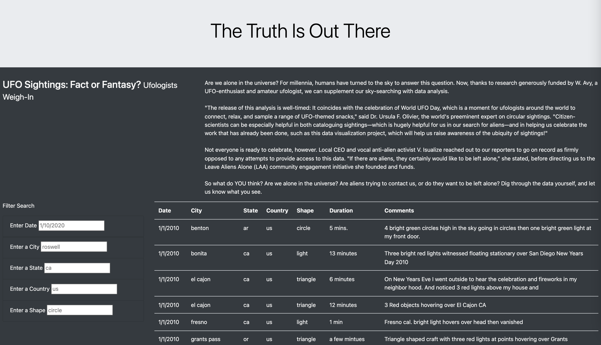
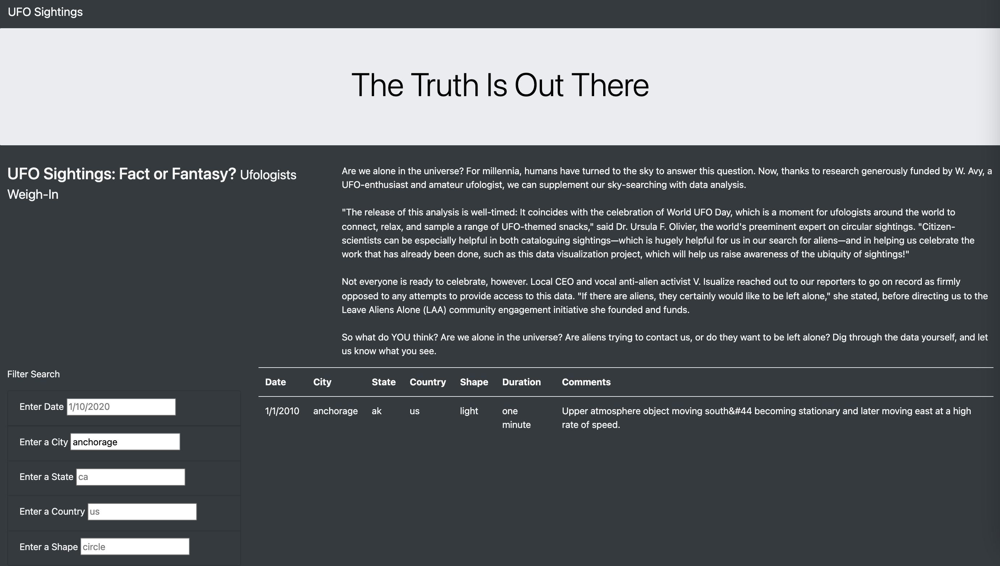

# UFO Sightings
Using JavaScript and HTML, you’ll modify the code in your index.html file to create more table filters. In addition to the date filter you created in this module, you’ll add filters for the city, state, country, and shape, as shown in the following image:

## Overview of Analysis
The purpose of this analysis was to create a webpage using HTML that displays a dynamic table that shows the unfiltered or filtered results of UFO sightings data. Visiters of the page can filter on data, city, state, country, or shape of the UFO. 

## Results
When on the page, UFO data sightings data will show below, unfiltered.

However, if wanting to filter the UFO data, then the filter fields can be used to search by date, city, state, country, or shape of the UFO. 

## Summary
The one drawback assocaited with this webpage is it isn't dynamic to fit different device sizes, such as iPad or mobile phone. In addition, another drawback is the minimal data of UFO sightings, making it difficult to search by anything other than the limited date, cities, states and countries of the current data on the page. 
A recommendation for further development would be to make the page dynamic to the device size, and also to pull in more UFO sightings data in order to search by more data options.

